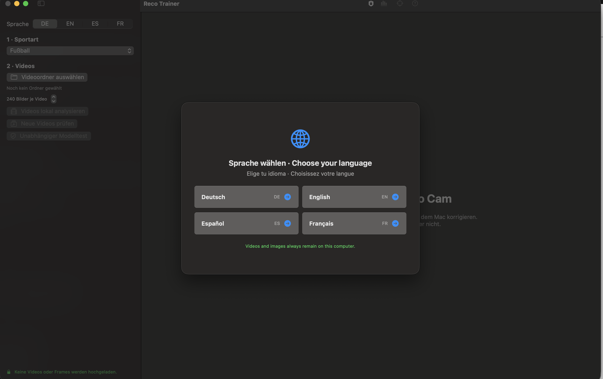
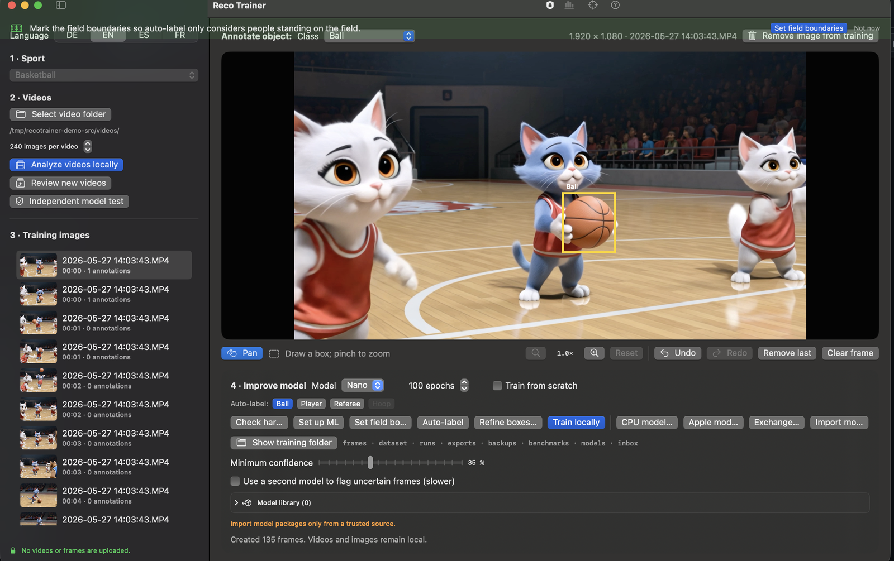
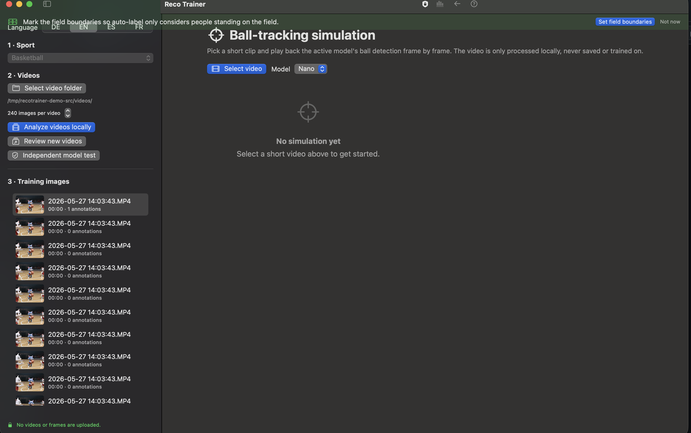

# Reco Trainer — User Guide

*A friendly introduction to training your own sports-object-detection model, no machine learning background required.*

All screenshots in this guide show AI-generated placeholder footage, not real recordings — see [Screenshots](#a-note-on-the-screenshots) at the end.

## Table of contents

1. [What is Reco Trainer, and why does "local" matter?](#1-what-is-reco-trainer-and-why-does-local-matter)
2. [Machine learning for the rest of us](#2-machine-learning-for-the-rest-of-us)
3. [Quickstart: your first model in five steps](#3-quickstart-your-first-model-in-five-steps)
4. [The core workflow, in detail](#4-the-core-workflow-in-detail)
5. [Advanced features](#5-advanced-features)
6. [Tips, troubleshooting, and good habits](#6-tips-troubleshooting-and-good-habits)
7. [Glossary](#7-glossary)

---

## 1. What is Reco Trainer, and why does "local" matter?

Reco Trainer is a tool for building a custom **object detection model** for your sport — something that can look at a video frame and draw a box around the ball, the players, the referee, the goal, or whatever else you care about. You feed it your own match or training footage, correct its mistakes a few times, and it gets better with each round.

The one thing Reco Trainer refuses to do, on principle, is send your footage anywhere. Every step — extracting frames, running the model, training, testing — happens on your own computer. Nothing is uploaded to a server, not even to "help improve the model for everyone." If you are training on footage of minors, of your own team, or of anything you'd rather not have leave the building, that matters more than a marginal accuracy gain from a shared cloud model ever could. It's also just simpler to reason about: what happens on your Mac (or your Windows/Linux machine, or your Docker container) stays on your Mac.

This guide walks through *why* the workflow is shaped the way it is, not just *which button to click* — understanding the "why" is what lets you get good results instead of just following steps blindly.

## 2. Machine learning for the rest of us

You don't need a machine learning background to use Reco Trainer, but a few core ideas will save you a lot of confusion later. Here they are, in plain English.

### A "model" is a pattern-matcher, not a rulebook

A detection model hasn't been *programmed* to recognize a basketball. It has looked at thousands of example images where someone drew a box around the basketball and said "this is a ball," and it gradually learned the visual pattern that tends to show up inside those boxes. It has no idea what a basketball actually *is* — it just knows what one tends to look like in pixels. That's why it can be fooled by things that look similar (an orange, a different kind of ball, a round shadow) and why it can miss the real ball if the lighting, angle, or blur is very different from anything it has seen before.

Reco Trainer doesn't start you from zero: it starts from **RF-DETR**, a strong general-purpose detection model that already understands "what an object roughly looks like." Training in Reco Trainer is really **fine-tuning** — nudging that existing knowledge toward *your* sport, *your* camera angle, and *your* categories, rather than teaching it to see from scratch. That's why useful results are possible from a few hundred frames instead of millions.

### Labeling is the whole game

Here's the part that surprises people coming from regular software: you don't really "program" the detection behavior. You *demonstrate* it, over and over, by telling the model "yes, that's a ball" or "no, that's not a player" on real example frames. The model then tries to generalize from those examples.

This means the model can only ever be as good as the labels you gave it. If you consistently draw boxes a bit too loosely, it learns to draw boxes a bit too loosely. If you miss the ball in blurry motion-heavy frames because they're annoying to label, the model will be bad at exactly those frames — which are often the ones you care about most. This isn't a Reco Trainer quirk; it's true of every model of this kind, from every vendor. In the field this is often summarized as **garbage in, garbage out**: a model trained on sloppy labels will confidently make sloppy predictions, and it will do so at real-time speed, which can look convincing right up until it matters.

The practical upshot: the time you spend correcting labels in the review screen is not busywork you're doing *for* the model — it is the training. Everything else in Reco Trainer (auto-labeling, active learning, training itself) exists to make that correction work faster and more targeted, not to replace it.

### Auto-labeling and "active learning" — getting the model to help you help it

Once you have *any* working model — even a rough first attempt — you can point it at new footage and have it guess the boxes for you. Reco Trainer calls this **auto-labeling**. You then don't have to draw every box from scratch; you just review the model's guesses and fix what's wrong. This is much faster than labeling blind, but it comes with a trap: if you only ever accept what the model already gets right, you never teach it anything new, and it plateaus.

**Active learning** is the fix for that trap. Instead of just running the model over everything, Reco Trainer can prioritize the frames the model is *least* sure about, or where two models disagree, or where a detection's position doesn't fit smoothly with its neighbors in time (see [Review-priority flags](#review-priority-flags-what-to-look-at-first) below). Those are exactly the frames most worth your attention — spending your limited review time there teaches the model more per minute than reviewing frames it already handles well.

### Training, epochs, and why "more" isn't always "better"

**Training** is the process of actually updating the model's internal parameters based on your labeled examples. It happens in rounds called **epochs** — one epoch means "the model has looked at every one of your labeled frames once and adjusted itself a little based on each one." Reco Trainer defaults to 100 epochs, which is a reasonable middle ground: enough rounds for the model to genuinely learn the pattern, not so many that training takes forever on a laptop.

More epochs isn't free, though. Train for too long on too little data and the model can start **overfitting** — memorizing your exact training frames (including their mistakes and quirks) instead of learning the general pattern. An overfit model looks great on the footage you trained it on and disappointing on anything new. This is one of the reasons Reco Trainer insists on testing against footage the model has genuinely never seen (see [Independent Model Test](#independent-model-test-a-fair-exam) below) rather than just trusting how well it does on its own training data.

### Confidence, precision, recall — reading the numbers without a statistics degree

A model doesn't just say "ball" or "not ball" — it outputs a **confidence** score for every guess, roughly "how sure am I." Reco Trainer's default cutoff is 0.35: guesses below that are treated as "not confident enough to show you." Raise the cutoff and you'll see fewer, more reliable boxes; lower it and you'll see more boxes, including more wrong ones.

When you compare models, you'll see a handful of standard metrics:

- **Precision** — of everything the model flagged as "ball," what fraction actually was a ball? Low precision means a lot of false alarms.
- **Recall** — of every real ball in the footage, what fraction did the model actually find? Low recall means it's missing things.
- **mAP** (mean Average Precision) — a single combined score that rewards a model for being both precise *and* thorough across all confidence levels. Higher is better; it's the number most people glance at first when comparing two models.

There's always a trade-off between precision and recall — a model that guesses "ball" on almost everything will have great recall and terrible precision, and vice versa. Which one matters more depends on what you're using the detections for.

## 3. Quickstart: your first model in five steps

If you just want to get moving, here's the short version. Each step is explained in much more depth in [section 4](#4-the-core-workflow-in-detail).

1. **Pick your sport and language.** Reco Trainer already knows the relevant categories (ball, player, referee, goal/hoop, …) for football, futsal, basketball, handball, hockey, rugby, lacrosse, and American football.
2. **Point it at a folder of your videos.** Reco Trainer extracts frames locally; nothing leaves your computer.
3. **Auto-label, then review.** Let the model guess, then walk through the candidates fixing what it got wrong. This is the step that actually teaches the model — don't rush it.
4. **Train.** Start a local training run (100 epochs by default) and let it work through your reviewed frames.
5. **Test and use.** Check the new model's numbers against an independent test set, then use it for auto-labeling more footage, live inference, or export it as a portable model package.

Then repeat steps 2–5 with new footage whenever you want the model to get better at something it's currently weak on.

## 4. The core workflow in detail

### Choosing a sport and language

Reco Trainer asks for your language and sport up front. The sport choice isn't cosmetic — it sets the category list you'll be labeling against (for example, basketball gives you *ball, player, referee, hoop*; football gives you *ball, player, goalkeeper, referee, goal*). Changing sport later is possible, but it makes sense to get this right at the start since it shapes everything downstream.

### First launch: video walkthrough or click-through guide

The very first time you open Reco Trainer, after picking a language, you can choose between a short video walkthrough (with captions in your chosen language) or the same tour as a click-through, text-based guide. Both cover the same ground — pick whichever you learn from better. You can reopen either one at any time from the "Show workflow" button in the toolbar.

### Selecting videos and extracting frames

Point Reco Trainer at a folder of video files. It extracts individual frames locally (by default, spread evenly through each video) that become the raw material for labeling. You don't need to extract *every* frame — a few hundred well-spread frames per video is usually enough to start, since consecutive video frames tend to look almost identical anyway and don't each teach the model something new.

### Auto-labeling and reviewing candidates

Once you have at least a base model to work with, "Analyze videos locally" runs it over your extracted frames and proposes boxes. These proposals land in a review queue as **candidates** — nothing is added to your actual training set until you've looked at it.

Reviewing a candidate frame means one of:

- **Accepting** the model's boxes as-is, because they're correct.
- **Correcting** them — resizing, moving, deleting, or adding a box — when the model got close but not quite right.
- **Rejecting** the frame entirely when it's not useful (motion blur, empty scene, nothing of interest).

Every correction you make is a small lesson for the *next* training run. This is genuinely the highest-leverage thing you can do to improve the model — more so than tweaking epochs or thresholds.

### Review-priority flags: what to look at first

Reco Trainer flags certain candidate frames as worth reviewing first, using two signals that need no manual setup:

- **Model disagreement** — if you have two installed models, an optional second pass compares their guesses; frames where they disagree are flagged, since disagreement usually means genuine ambiguity.
- **Temporal outliers** — for frames that are part of a video sequence, Reco Trainer checks whether a detection's position makes sense given where the same object was just before and just after. A ball that "teleports" between two frames is very likely a wrong detection, not a fast ball.

Flagged frames appear first in the queue with a warning icon and a short reason. This only ever changes review *order* — it never changes what gets trained on.

### Training locally

Once you've reviewed enough frames, start a training run. You'll set:

- **Epochs** — how many passes through your labeled data (100 by default; see [section 2](#training-epochs-and-why-more-isnt-always-better) for the trade-off).
- **Train from scratch** — normally training continues from the current checkpoint, which is faster and usually what you want. Turn this on when you've added a brand-new category the current model was never trained on (RF-DETR can't just bolt a new category onto an existing checkpoint's classification head — it needs a full run from the base model to actually learn it).

Training runs entirely on your machine, using your GPU if you have one and your CPU otherwise (slower, but it works). Progress and per-category metrics are shown as it goes.

### What actually stays local

Every video frame, every label, every trained checkpoint, and every metric lives in your project folder on your own disk. Reco Trainer's own servers only ever see a version-check request (to tell you a new release exists) — never your footage, your labels, or your models.

## 5. Advanced features

### Independent Model Test — a fair exam

A model that's tested on the same footage it was trained on will always look better than it really is — it has effectively seen the answers already. **Independent Model Test** lets you designate a separate video folder — one that was *never* used for training — and turn it into a genuinely held-out test set. Model comparisons then use this independent set for their reference numbers, so a model can't score well purely because it recognizes footage it already knows.

If you only ever test on your training footage, you're not measuring how good your model is — you're measuring how well it memorized.

### Model Benchmark / Comparison

Once you have more than one model (say, an older and a newer version, or two models trained on different footage), the benchmark screen runs both against your independent test set and lays out precision, recall, mAP, and per-category breakdowns side by side. Look at the per-category numbers, not just the overall score — a model can look great overall while being genuinely bad at, say, detecting the referee, if referees are rare in your footage.

A model with a different set of categories than your current one isn't automatically flagged as "worse" just because its overall score is lower — the scores aren't directly comparable in that case, and the comparison points you to the per-category view instead.

### Creating a combined model

If one model is your best performer for the ball and a different one is your best for the referee, you can "bake" a combined model: for each category, it uses whichever source model is strongest at it. This isn't a real merge of the underlying weights (RF-DETR doesn't support that) — each source model keeps handling its own assigned categories at inference time — but the result behaves like, and appears in your library as, an ordinary single model.

### Ball-tracking simulation

This panel plays back a short clip frame by frame, running the active model's ball detection live and color-coding the result: detected (green), interpolated between two real detections (orange), held at the last known position (yellow), or lost entirely. A slider controls how far ahead/behind the interpolation is allowed to look. It's a fast, visual way to sanity-check a model's real-world tracking behavior — including its failure modes — without setting up a full pipeline. Nothing here is saved or used for training; it's purely for your own inspection.

### Field geometry editor

For sports where knowing the playing surface's layout matters (for example, mapping detections to real-world court/pitch coordinates), you can mark the field's corners on a reference frame once per project.

### Model packages (`.recomodel`)

A trained model can be exported as a single `.recomodel` package — useful for moving a model between machines, sharing it with a teammate, or backing it up. On import (and again immediately before any actual use, such as training, auto-labeling, or export), Reco Trainer checks the package against its manifest checksum and additionally loads it through PyTorch's safe-loading mode, which rejects anything containing more than plain model weights — such as executable code that would otherwise run automatically when the file is opened. This matters because a checksum alone only proves a file matches its own manifest, not that it's safe: whoever builds a package also controls its checksum. Treat model packages the same way you'd treat any other file from someone else — only import ones you trust.

## 6. Tips, troubleshooting, and good habits

- **Review before you train, every time.** A training run only ever learns from frames you've actually reviewed — candidates still sitting in the queue are ignored.
- **Prefer variety over volume.** Fifty frames spanning different lighting, angles, and situations teach the model more than five hundred near-identical frames from one clip.
- **Don't skip the hard frames.** The blurry, awkward, oddly-lit frames you're tempted to reject are usually exactly the ones the model needs to see to get good at real match conditions.
- **Use an independent test set honestly.** Resist the temptation to peek at test footage while labeling training data — the moment you do, it stops being independent.
- **Retrain instead of tweaking thresholds forever.** If a model consistently misses something, lowering the confidence threshold treats the symptom; showing it more corrected examples of that exact situation treats the cause.

## 7. Glossary

| Term | Plain-English meaning |
|---|---|
| **Model** | The trained pattern-matcher that looks at an image and proposes boxes + categories. |
| **RF-DETR** | The general-purpose detection model Reco Trainer starts from before fine-tuning it on your footage. |
| **Fine-tuning** | Continuing to train an existing model on new, specific data instead of starting from nothing. |
| **Label / annotation** | A box drawn around an object in a frame, tagged with its category (ball, player, …). |
| **Auto-labeling** | Having the current model guess labels for new frames automatically, for you to review. |
| **Active learning** | Prioritizing which unlabeled frames to review next based on where the model is least certain. |
| **Candidate** | A frame with model-proposed labels that hasn't been reviewed yet. |
| **Epoch** | One full pass of the training process through all your labeled frames. |
| **Overfitting** | A model that has memorized its training data's quirks instead of learning the general pattern — looks great on training footage, disappoints on new footage. |
| **Confidence threshold** | The minimum certainty score a detection needs before Reco Trainer shows it to you. |
| **Precision** | Of everything flagged as an object, the fraction that was actually correct. |
| **Recall** | Of every real object present, the fraction the model actually found. |
| **mAP** | A single combined accuracy score balancing precision and recall — higher is better. |
| **Independent test set** | Footage the model has never seen used purely for evaluation, never for training. |
| **Checkpoint** | A saved snapshot of a model's trained state that training can continue from. |
| **`.recomodel`** | Reco Trainer's portable, checksummed model-package file format. |

---

## A note on the screenshots

Every screenshot in this guide was captured from Reco Trainer running against AI-generated placeholder footage — never real match recordings of real people. That's a deliberate choice, not an oversight: this guide exists to help you use a tool that's built around keeping *your* footage private, so it would be a strange way to start by publishing someone else's.
